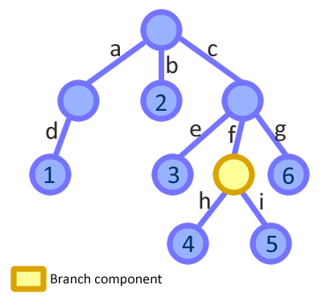
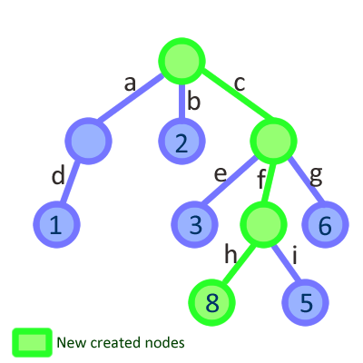

# Freezer

A tree data structure that is always updated from the root, even if the modification is triggered by one of the leaves, making easier to think in a reactive way.

[](https://travis-ci.org/arqex/freezer)
[](http://badge.fury.io/js/freezer-js)

Freezer is made with React.js in mind and uses real immutable structures, it is the perfect store for your Flux implementation. 

What makes Freezer special is:

* Immutable trees to make fast comparison among nodes.
* Eventful nodes to notify updates to other parts of the app.
* No dependencies.
* Lightweight: ~7KB minified (much less if gzipped).
* Packaged as UMD module to be loaded everywhere.
* Uses common JS array and objects to store the data.

Do you want to know more?

* [Demos](#demos)
* [Installation](#installation)
* [Example](#example-of-use)
* [Motivation](#why-another-store)
* [Freezer API](#api)
* [Updating the data](#update-methods)
* [Events](#events-1)
* [Batch updates](#batch-updates)
* [Changelog](#changelog)

## Demos
* [You can **test** freezer.js in this JSbin](http://jsbin.com/fedeva/4/edit?js,console)
* [A JSON editor with undo and redo](http://jsbin.com/hugusi/1/edit?js,output), and [here the blog article](http://arqex.com/991/json-editor-react-immutable-data) explaining it 

## Installation
Freezer is available as a npm package.
```
npm install freezer-js
```

Also as a bower package
```
bower install freezer-js
```

It is possible to download the [full version](https://raw.githubusercontent.com/arqex/freezer/master/build/freezer.js) (~13KB) or [minified](https://raw.githubusercontent.com/arqex/freezer/master/build/freezer.min.js) (~7KB).

## Example of use
You can play with [this example in JSBin](http://jsbin.com/suvoxivizi/2/edit?js,console).
```js
// Browserify/Node style of loading
var Freezer = require('freezer-js');

// Let's create a freezer store
var store = new Freezer({
    a: {x: 1, y: 2, z: [0, 1, 2] },
    b: [ 5, 6, 7 , { m: 1, n: 2 } ],
    c: 'Hola',
    d: null // It is possible to store whatever
});

// Let's get the frozen data stored
var data = store.get();

// Listen to changes in the store
store.on('update', function( newValue ){
    // New value will have the updated store's data
    console.log( 'I was updated' );
});

// The data is read as usual
console.log( data.c ); // logs 'Hola'

// And used as usual
data.a.z.forEach( function( item ){
    console.log( item );
}); // logs 0, 1 and 2

// But it is immutable, so...
data.d = 3; console.log( data.d ); // logs null
data.e = 4; console.log( data.e ); // logs undefined

// to update, use methods like set that returns new frozen data
var updated = data.set( 'e', 4 ); // On next tick it will log 'I was updated'

console.log( data.e ); // Still logs undefined
console.log( updated.e ); // logs 4

// Store data has changed!
store.get() !== data; // true
store.get() === updated; // true

// The nodes that weren't updated are reused
data.a === updated.a; // true
data.b === updated.b; // true

// Updates can be chained because the new immutable
// data node is always returned
var updatedB = updated.b.push( 100 )
    .shift()
    .set(0, 'Updated')
; // It will log 'I was updated' on next tick, just once

// updatedB is the current b property
store.get().b === updatedB; // true

// And it is different from the one that started
updated !== store.get(); // true
updated.b !== updatedB; // true
console.log( updated.b[0] ); // updated did't/can't change: logs 5
console.log( updatedB[0] ); // logs 'Updated'
console.log( updatedB[4] ); // logs 100
updatedB.length === 5; // true: We added 2 elements and removed 1

// Untouched nodes are still the same
data.a === store.get().a; // still true
updated.a === store.get().a; // still true

// Reverting to a previous state is as easy as
// set the data again (Undo/redo made easy)
store.set( data ); // It will log 'I was updated' on next tick

store.get() === data; // true
```


## Why another store?

**Freezer** is inspired by other tree cursor libraries, specially [Cortex](https://github.com/mquan/cortex) that try to solve an inconvenient of the Flux architecture:

* If you have a store with deep nested data and you need to update some value from a child component that reflect that data, you need to dispatch an action and from the top of the store look for the bit of data again to update it. That may involve a lot of extra code to propagate the change and it is more painful when you think that the component knew already what data to update.

In the other hand, data changes always flowing in the same direction is what make Flux architecure so easy to reason about. If we let every component to update the data independently we are building a mess again.

So *Freezer*, instead of letting the child component to update the data directly, gives in every node the tools to require the change. The updates are always made by the root of the store and the data can keep flowing just in one direction.

Imagine that we have the following tree structure as our app store: 

And we have a component responsible of handling the `store.c.f` ( the yellow node ) part of the data. Its scope is just that part of the tree, so the component receives it as a prop:
```js
// The component receives a part of the freezer data
this.props.branch = { h: 4, i: 5};
```
Eventually the component is used to update `store.c.f.h = 8`. You can dispatch an action with the frozen node as the payload ( making easier for your actions know what to update ), or even use the node itself to require the change:
```js
this.props.branch.set( {h: 8} );
```
Then, *Freezer* will create a new immutable data structure starting from the top of the tree, and our component will receive a new branch to render. The store finished like this: 

Since the whole tree is updated, we can have the main app state in one single object and make the top level components re-render in a reactive way to changes that are made deep in the store hierarchy.

**Freezer** is very influenced by the way that [Facebook's Immutable](https://github.com/facebook/immutable-js) handles immutabilty. It creates a new tree every time that a modification is required referencing the non modified nodes from the previous tree. Sharing node references among frozen objects saves memory and boost the performance on creating new frozens.

Using immutability with React is great, because you don't need to make deep comparisons in order to know when to update a component:
```js
shouldComponentUpdate: function( nextProps ){

    // The comparison is fast, and we won't render the component if
    // it does not need it. This is a huge gain in performance.
    return this.props.store != nextProps.store;
}
```

*Freezer* has less features than *Immutable*, but its API is simpler and it is much more lightweight (Minified, Immutable is ~56KB and Freezer ~7KB).

Instead on learning the set of methods needed to use *Immutable*, *Freezer* uses common JS objects and arrays to store the data, so you can start using it right now.

## API

Create a freezer object using the constructor:
```js
var store = new Freezer({a: 'hola', b:[1,2, [3,4,5]], c: false });
```
And then, Freezer API is really simple and only have 2 methods: `get` and `set`. A freezer object also implements the [listener API](#listener-api).

#### get()

Returns an frozen object with the freezer data.
```js
// Logs: {a: 'hola', b:[1,2, [3,4,5]], c: false }
console.log( store.get() ); 
```
The data returned is actually formed by arrays and objects, but they are sealed to prevent their mutation and they have some methods in them to update the store.
Everytime an update is performed, `get` will return a new frozen object.

#### set( data )

Replace the current frozen data with new one.
```js

// An example on how to undo an update would be like this...
var store = new Freezer({a: 'hola', b:[1,2, [3,4,5]], c: false }),
    data = store.get()
;

var updated = data.set({c: true});
console.log( updated.c ); // true

// Restore the inital state
store.set( data );
console.log( store.get().c ); // false
```

#### Events

Every time that the data is updated, an `update` event is triggered on the store. In order to use those events, *Freezer* stores implement the [listener API](#listener-api), and `on`, `once` and `off` methods are available on them.

## Update methods

Freezer data has three different types of nodes: *Hashes*, *Arrays* and *leaf nodes*. A leaf node can't be updated by itself and it need to be updated using its parent node. Every updating method return a new immutable object with the new node result of the update:
```js
var store = new Freezer({obj: {a:'hola', b:'adios'}, arr: [1,2]});

var updatedObj = store.get().obj.set('a', 'hello');
console.log( updatedObj ); // {a:'hello', b:'adios'}

var updatedArr = store.get().arr.unshift( 0 );
console.log( udpatedArr ); // [0,1,2]

// {obj: {a:'hello', b:'adios'}, arr: [0,1,2]}
console.log( store.get() ); 
```

 Both, *Array* and *Hashes* nodes have a `set` method to update or add elements to the node and a `reset` method to replace the node by other data.

#### set( keyOrHash, value )
Arrays and hashes can update their children using the `set` method. It accepts a hash with the keys and values to update or two arguments, the key and the value.
```js
var store = new Freezer({obj: {a:'hola', b:'adios'}, arr: [1,2]});

// Updating using a hash
store.get().obj.set( {b:'bye', c:'ciao'} );

// Updating using key and value
store.get().arr.set( 0, 0 );

// {obj: {a:'hola', b:'bye', c:'ciao'}, arr: [0,2]}
console.log( store.get() )
```

#### reset( newData )
Reset/replaces the node with new data. Listeners are preserved if the new data is an `array` or `object`, so it is possible to listen to reset calls. 

```js
var store = new Freezer({ foobar: {a: 'a', b: 'b', c: [0, 1, 2] } });

var newfoobar = { foo: 'bar', bar: 'foo' };

var reset = data.foobar.reset(newfoobar);

console.log( reset ); //{ foo: 'bar', bar: 'foo' }
```

#### toJS()
*Freezer* nodes are immutable. `toJS` transform *Freezer* nodes to plain mutable JS objects in case you need them.
```js
// Require node.js assert
var assert = require('assert');

var data = {obj: {a:'hola', b:'adios'}, arr: [1,2]},
    store = new Freezer( data )
;

assert.deepEqual( data, store.get().toJS ); // Ok
```

## Hash methods
#### remove( keyOrKeys )
Removes elements from a hash node. It accepts a string or an array with the names of the strings to remove.

```js
var store = new Freezer({a:'hola', b:'adios', c:'hello', d:'bye'});

var updated = store.get()
    .remove('d') // Removing an element
    .remove(['b', 'c']) // Removing two elements
;

console.log( updated ); //{a: 'hola'}
```


## Array methods
Array nodes have modified versions of the `push`, `pop`, `unshift`, `shift` and `splice` methods that update the cursor and return the new node, instead of updating the immutable array node ( that would be impossible ).
```js
var store = new Freezer({ arr: [0,1,2,3,4] });

store.get().arr
    .push( 5 ) // [0,1,2,3,4,5]
    .pop() // [0,1,2,3,4]
    .unshift( 'a' ) // ['a',0,1,2,3,4]
    .shift() // [0,1,2,3,4]
    .splice( 1, 1, 'a', 'b') // [ 0, 'a', 'b', 2, 3, 4]
;
```

Array nodes also have the `append` and `prepend` methods to batch insert elements at the begining or the end of the array.
```js
var store = new Freezer({ arr: [2] });

store.get().arr
    .prepend([0,1]) // [0,1,2]
    .append([3,4]) // [0,1,2,3,4]
;
```

## Events
Freezer objects emit `update` events whenever their data changes. It is also possible to listen to `update` events in a intermediate node by creating a listener on it using the method `getListener`.

#### getListener()
Returns a listener that emits an `update` event when the node is updated. The listener implements the [listener API](#listener-api).
```js
var store = new Cursor({ arr: [2] }),
    data = store.get(),
    listener = data.arr.getListener()
;

listener.on('update', function( data ){
    console.log( 'Updated!' );
    console.log( data );
});

data.arr.push( 3 ); //logs 'Updated!' [2,3]
```

## Listener API
Freezer stores and listeners implement this API that is influenced by the way Backbone handle events. The only event that Freezer emits is `update`, end is emitted on every store/node update.

#### on( eventName, callback )
Register a function to be called when an event occurs.
#### once( eventName, callback )
Register a function to be called once when an event occurs. After being called the callback is unregistered.
#### off( eventName, callback )
Can unregister all callbacks from a listener if the `eventName` parameter is omitted, or all the callbacks for a `eventName` if the `callback` parameter is omitted.
#### trigger( eventName [, param, param, ...] )
Trigger an event on the listener. All the extra parameters will be passed to the registered callbacks.

## Batch updates
At some point you will find yourself wanting to apply multiple changes on some node at a time. On every change the full tree is re-generated, but probably the only tree needed is the final result of all those changes. 

Freezer nodes offer a `transact` method to make local modifications to them without generating intermediate frozen trees, and a `run` method to commit all the changes at once. This way your app can have a really good performance.

```js
var frozen = new Freezer({list:[]}),
    data = frozen.get()
;

// transact returns a mutable object
// to make all the local changes
var trans = data.list.transact();

// trans is a common array
for( var i = 0; i < 1000; i++ )
    trans.push(i);

// use it as a normal array
trans[0] = 1000; // [1000, 1, 2, ..., 999]

// the store does not know about the yet
frozen.get().list.length == 0; // true

// to commit the changes use the run method in the node
data.list.run();

// all the changes are made at once
frozen.get().list; // [1000, 1, 2, ..., 999]
```

Transactions are designed to always commit the changes, so if you start a transaction but you forget to call `run`, it will be called automatically on the next tick.

It is possible to update children nodes of a node that is making a transaction, but it is not really recommended. Those updates will not update the store until the transaction in the parent node is commited, and that may lead to confussion if you use child nodes as common freezer nodes. Updating child nodes doesn't improve its performance much because of having a transacting parent, so it is recommended to make the changes in the transaction node and run it as soon as you have finished with the modifications to prevent undesired behavior. 

## Changelog
[Here](https://github.com/arqex/freezer/blob/master/CHANGELOG.md)
